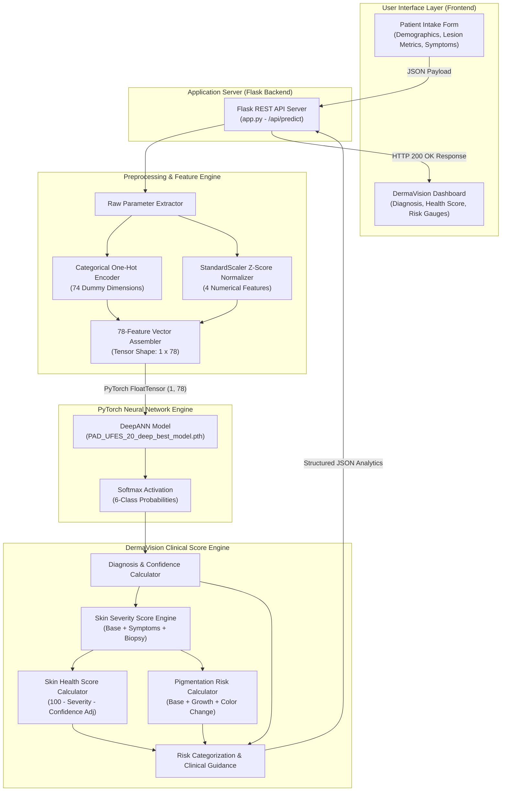

# DermaVision AI — System Architecture Diagram (Module 1)

This document presents the high-level system architecture and data transformation pipeline for **DermaVision AI Module 1** (ANN/MLP-Based Skin Disease Classification & Risk Score Engine).

## High-Level Architecture Diagram

## System Component Breakdown

| Component | Responsibility | Inputs / Outputs |
| :--- | :--- | :--- |
| **User Intake Form** | Collects patient demographics, lesion metrics, and clinical symptoms. | Raw user inputs → JSON Payload |
| **Flask API Server** | Handles HTTP requests, orchestrates pipeline, and returns JSON predictions. | POST `/api/predict` → Response JSON |
| **Preprocessing Engine** | Performs standardization and one-hot encoding into a 78-feature vector. | 18 Raw Parameters → `torch.Tensor` (1, 78) |
| **Deep ANN PyTorch Model** | Computes forward pass through trained neural network layers (`78 -> 256 -> 128 -> 64 -> 6`). | `torch.Tensor` (1, 78) → Logits & Probabilities |
| **Score Engine** | Derives **Skin Health Score**, **Pigmentation Risk Score**, and clinical categories. | Class Probabilities → Clinical Risk Metrics |
| **DermaVision Dashboard** | Renders interactive gauges, confidence metrics, probability bar charts, and clinical guidance. | Clinical Analytics → Rich Web Visuals |
