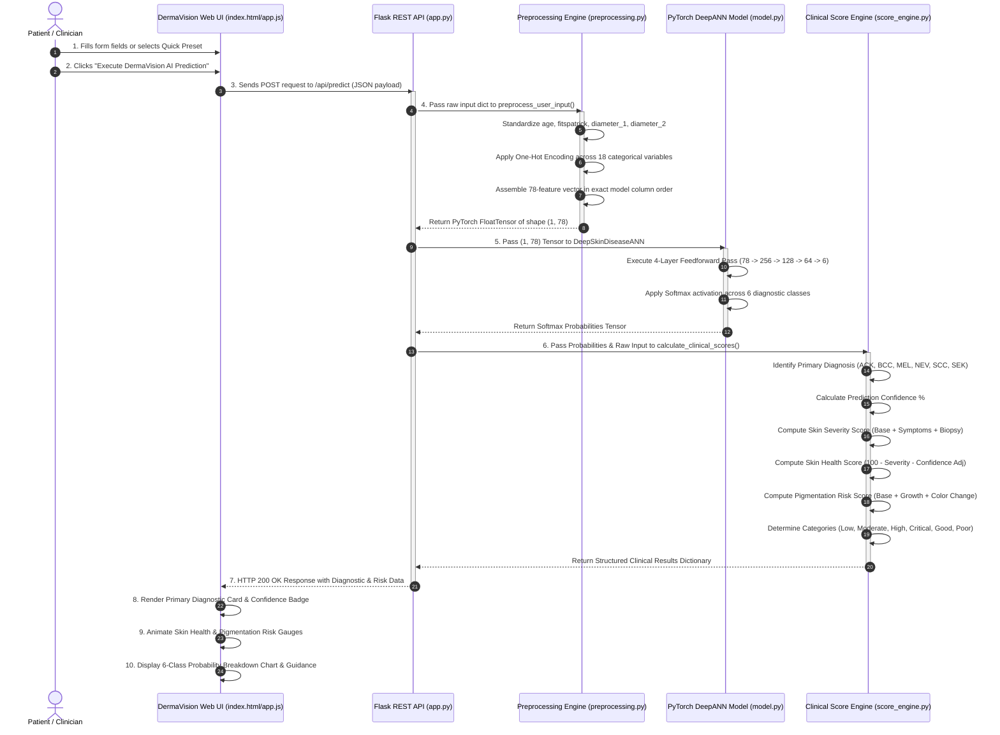

# DermaVision AI — Workflow Sequence Diagram (Module 1)

This document illustrates the step-by-step execution workflow from patient information entry to dashboard visualization.

## Workflow Sequence Diagram

## Step Summary Table

| Step | Action | Description |
| :--- | :--- | :--- |
| **Step 1** | Form Input | User inputs age, Fitzpatrick skin type, lesion diameter, body region, and clinical symptoms. |
| **Step 2** | One-Hot Encoding | Categorical values are converted into 74 binary indicator fields. |
| **Step 3** | Numerical Normalization | `age`, `fitspatrick`, `diameter_1`, and `diameter_2` are normalized via Z-score formula `(x - μ) / σ`. |
| **Step 4** | Tensor Assembly | Features are ordered into an exact 78-element PyTorch `FloatTensor`. |
| **Step 5** | Model Forward Pass | Tensor flows through `Linear` and `ReLU` layers of `DeepSkinDiseaseANN`. |
| **Step 6** | Score Calculation | Clinical risk and health scores are generated using diagnostic baselines and symptom adjustments. |
| **Step 7** | Dashboard Rendering | Web interface animates score bars, badges, and probability distributions. |
